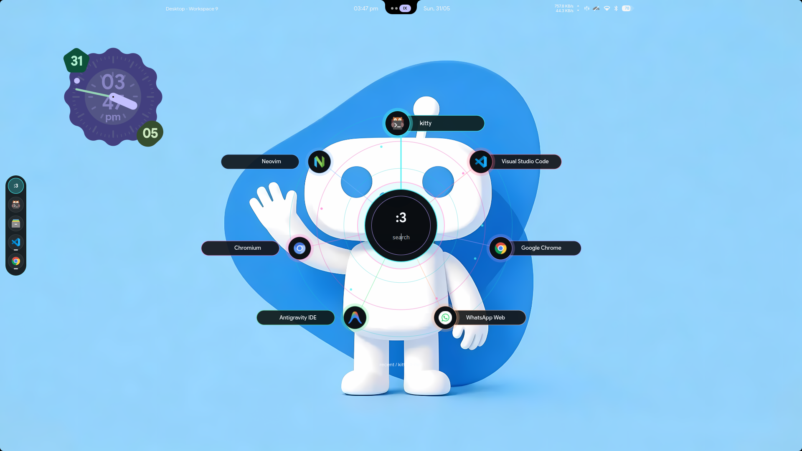
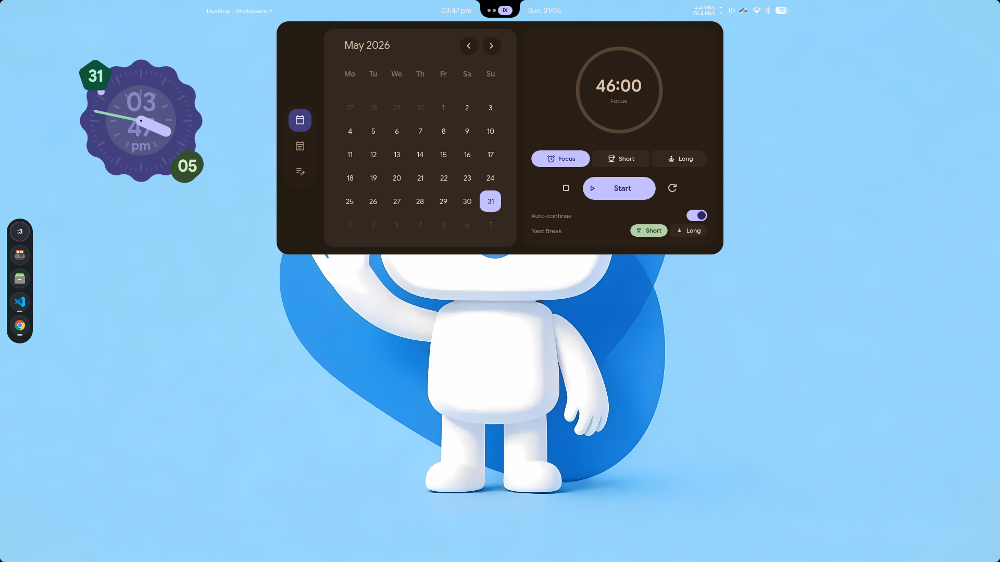

# Asura Quickshell

Standalone public backup of the `nandoroid` shell configuration for Hyprland/CachyOS.

> [!WARNING]
> This repository is highly experimental and unstable. Most of the code chunks were generated or heavily modified using **Codex 5.5** while tuning a live setup, meaning some features may be incomplete, machine-specific, or broken outside this environment. Use as a reference/backup, not as a polished drop-in shell.


## Screenshots





## Install & Run

```bash
# Clone to config path
git clone https://github.com/Valo-Asura/asura-quickshell.git ~/.config/quickshell/nandoroid

# Start shell
quickshell -c nandoroid

# Restart shell after modifications
~/.config/quickshell/nandoroid/scripts/restartshell.sh
```

## Features

- **Launcher Dial:** GPU-accelerated circular dial with counter-rotating labels, shortest-path wrapping, and calibrated touchpad/mouse scroll swipes.
- **Smart Dock:** Overlay auto-hide dock with 250ms gap-hover grace period, full-height click-through edge trigger, and live window previews.
- **HyprMod Display Entry:** Searching `display`, `monitor`, `dual monitor`, `HDMI`, or pressing `Super + P` opens the HyprMod monitor workflow through the local `asura-display-manager` wrapper.
- **Quick Wallpaper Picker:** Separate quick wallpaper selector inspired by `skwd-wall`, with local image and live-wallpaper entry points.
- **Workspace Overview:** `Alt + Tab` opens the Nandoroid workspace overview so windows can be moved between workspaces by drag/drop.
- **Status Bar Hardware Feedback:** Battery charging uses the cyan animated state, and system widgets are wired to local Hyprland/system services.
- **Foot/Ghostty Terminal Defaults:** Shell actions now prefer Foot, with Ghostty configured separately for Fastfetch-on-open in the system config repo.
- **Intel Power Syncer:** Real-time cpufreq governor, EPP, and Turbo Boost sysfs syncer daemon for Intel Core (i5-12500H) laptops.
- **Greetd Isolation:** Console-based login manager `tuigreet` cleanly isolated to VT 2 with custom systemd service override.

## Keybinds

- `Super + A` / `Space`: Launcher
- `Super + D`: Dashboard
- `Super + N`: Quick Settings
- `Super + G`: Quick Actions
- `Super + I`: Settings Sidebar
- `Super + W`: System Monitor
- `Super + P`: HyprMod display/monitor manager
- `Super + V`: Clipboard History
- `Alt + Tab`: Workspace overview

## Related System Backup

Full system restore scripts, terminal configs, Hyprland config, NVIDIA boot
recovery docs, package manifests, and AI-memory documentation live in:

```text
https://github.com/Valo-Asura/asura-system-config
```

## Credits

Thanks to [na-ive](https://github.com/na-ive) for making Nandoroid, which this setup is based on.
