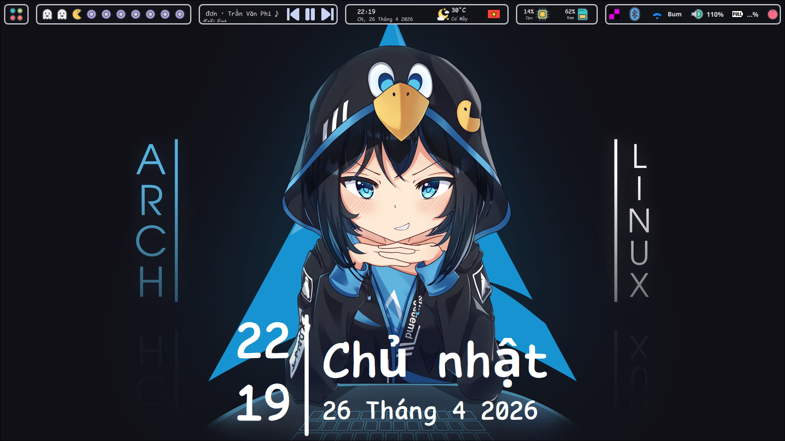
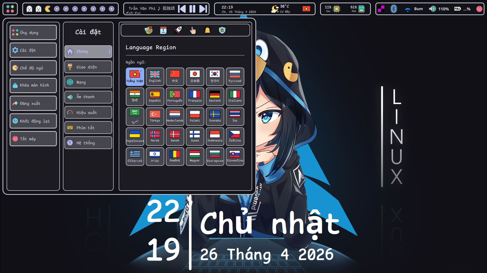
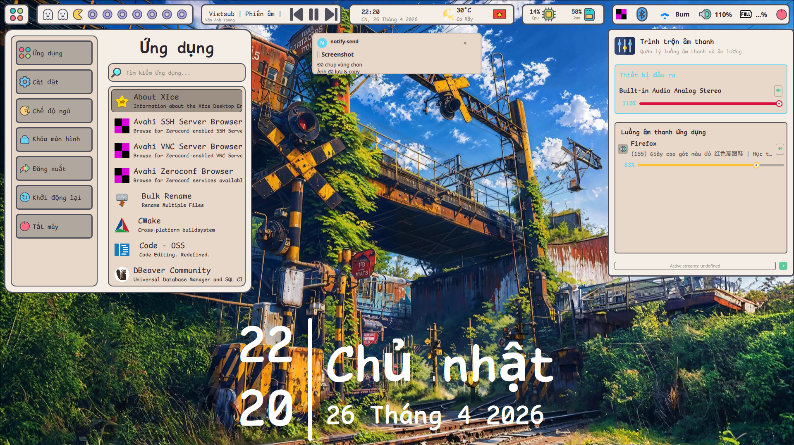
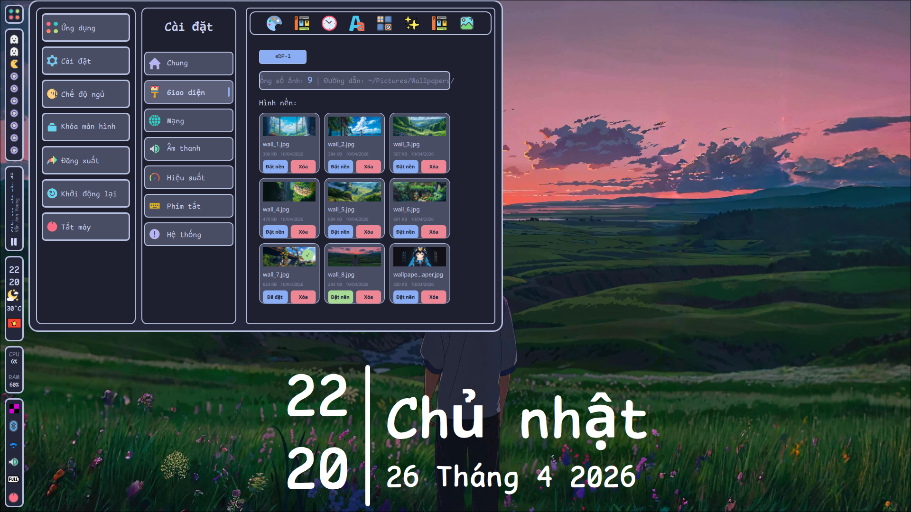
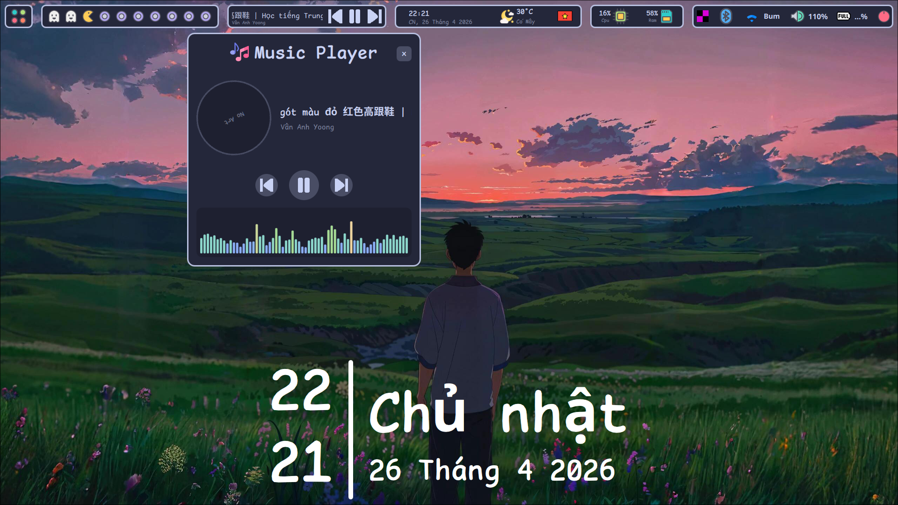

# 🎨 Cartoon Shell - QuickShell Panel for Hyprland

<div align="center">

[Cartoon Shell Screenshot](https://github.com/user-attachments/assets/315049eb-89f6-47e3-8890-e7c2b4364025)

*A modern, feature-rich Wayland panel built with QuickShell for Hyprland*

[](https://hyprland.org/)
[](https://github.com/outfoxxed/quickshell)

</div>

---


<h2>📸 Screenshots</h2>
<p align="center">
  
</p>
<p align="center">
  
  
</p>

<p align="center">
  
  
</p>


## 🎯 Introduction

**Cartoon Shell** is a modern Wayland panel built entirely with **QuickShell** (QML) specifically for **Hyprland window manager**. The panel provides a smooth user experience with highly customizable interface, multi-language support, and multi-resolution display compatibility.


## 💻 System Requirements

### Operating System
- **Linux** (developed on Arch Linux)
- **Wayland** compositor (X11 not supported)
- **Hyprland** window manager (required)

### Main Dependencies

#### QuickShell & Qt
```bash
# QuickShell framework
quickshell

# Qt modules (usually bundled with QuickShell)
qt6-base
qt6-declarative
qt6-wayland
```

#### System utilities
```bash
# Hyprland (Required)
hyprland              # Wayland compositor
hyprctl               # Hyprland control (bundled with hyprland)

# Wallpaper (Required)
ffmpeg                # Video thumbnail generation

# Media player (Required)
cava                  # Audio visualizer for Music Panel

# Network (Required)
networkmanager        # WiFi/Network management
bluez                 # Bluetooth
bluez-utils           # Bluetooth utilities

# System monitoring (Usually pre-installed)
procps-ng             # top, free commands
iproute2              # ip command

# Audio (Usually pre-installed)
pipewire              # Audio server
wireplumber           # PipeWire session manager

# Other (Required)
curl                  # API calls (weather)
jq                    # JSON processing
python3               # Python scripts
```

#### Font
```bash
ttf-comicshannsmono-nerd
ttf-material-symbols-variable-git
```


## 🔧 Installation

### 1. Install dependencies (Arch Linux)

#### Full setup with dotfiles
```bash
cd ~
git clone https://github.com/mailong2401/dotfiles-hyprland
cd dotfiles-hyprland
chmod +x setup.sh
./setup.sh
```

#### Or manual installation
```bash
# Install main packages (Arch Linux)
sudo pacman -S hyprland hyprpaper networkmanager \
               bluez bluez-utils pipewire wireplumber curl python \
               jq ffmpeg

# Install AUR packages
yay -S quickshell-git cava ttf-comicshannsmono-nerd ttf-material-symbols-variable-git
```

### 2. Clone Cartoon Shell
```bash
# Clone to QuickShell config directory
git clone https://github.com:mailong2401/cartoon-shell.git \
    ~/.config/quickshell/cartoon-shell

cd ~/.config/quickshell/cartoon-shell
```

### 3. Run QuickShell
```bash
# Run directly
quickshell --path ~/.config/quickshell/cartoon-shell

# Or add to Hyprland config
echo "quickshell --path ~/.config/quickshell/cartoon-shell" \
    >> ~/.config/hypr/hyprland.conf
```


---
## Contributors

<table>
  <tbody>
    <tr>
      <td align="center" valign="top" width="25%"><a href="https://github.com/crystalforceix"><br /><sub><b>Anh Ba Phu</b></sub></a><br /></td>
    </tr>
  </tbody>
</table>

## Star History

<a href="https://www.star-history.com/#mailong2401/cartoon-shell&type=date&legend=top-left">
 <picture>
   <source media="(prefers-color-scheme: dark)" srcset="https://api.star-history.com/svg?repos=mailong2401/cartoon-shell&type=date&theme=dark&legend=top-left" />
   <source media="(prefers-color-scheme: light)" srcset="https://api.star-history.com/svg?repos=mailong2401/cartoon-shell&type=date&legend=top-left" />
   
 </picture>
</a>
