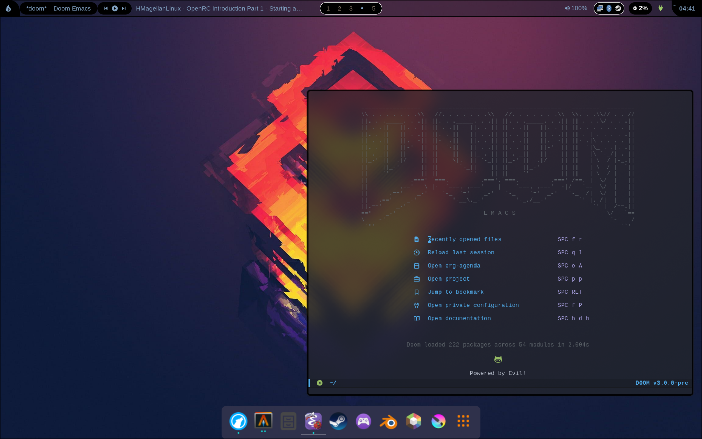
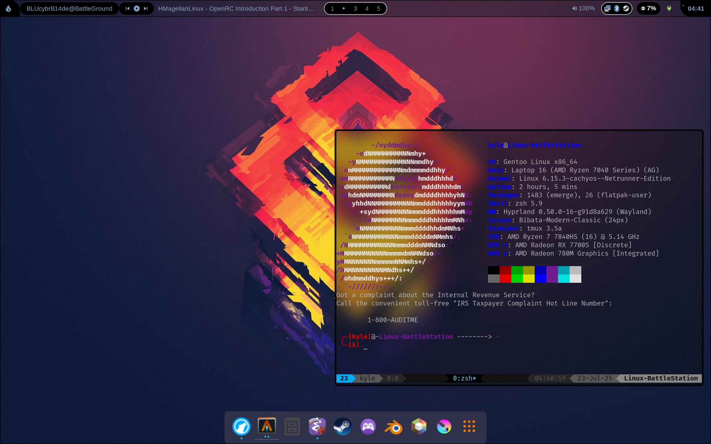

<h1> My dotfiles for <a href="https://www.gnu.org/gnu/linux-and-gnu.html">GNU/Linux </h1>

 
 

 
<ul>
  <h3><li>This configuration is for my <a href="https://codeberg.org/blucybrb14de/gentoo-installguide">Gentoo</a> <a href="https://wiki.gentoo.org/wiki/Hyprland">Hyprland </a> Desktop</h3></li>
  
 Rice inspired by <a href="https://github.com/linuxmobile/hyprland-dots">linuxmobile/hyprland-dots</a>
</ul>
 
 

 

   

   

 

# Desktop Rice (Software Used)

## Window Manager

- <a href="https://github.com/hyprwm/Hyprland">Hyprland WM</a>
  - <a href="https://codeberg.org/blucybrb14de/dotfiles/src/branch/gentoo-hyprland/Hypr/hyprland.conf">Config File</a>

- 
Background
・<a href="https://codeberg.org/blucybrb14de/dotfiles/src/branch/gentoo-hyprland/backgrounds/Ghosts.webp">Ghosts.webp</a>

- <a href="https://qutebrowser.org">Qutebrowser</a>

## Shell Components

 

- <a href="https://github.com/nwg-piotr/nwg-shell">Some Components from NWG Shell are Used </a>
  - <a href="https://github.com/nwg-piotr/nwg-dock-hyprland">Nwg Dock (Hyprland)</a>
  - <a href="https://github.com/nwg-piotr/nwg-drawer">Nwg Drawer</a>

 

## Application launcher & Status Bar

<a href="https://wayland.freedesktop.org">

<a href="https://sr.ht/~scoopta/wofi/">Wofi</a>
- <a href="https://codeberg.org/blucybrb14de/dotfiles/src/branch/gentoo-hyprland/wofi/config">Config File</a>

<a href="https://store.kde.org/browse?cat=418&ord=late">Waybar</a>
  - <a href="https://codeberg.org/blucybrb14de/dotfiles/src/branch/gentoo-hyprland/waybar/config.jsonc">Config File</a>

 
 

# Shell Prompt & Preview

# Other Software that I "Use"

 
 

| [Gentoo](https://gentoo.org) &mdash; Package Name                                   | Source                                                                                                                 |
|-----------------------------------------------------------------------|:----------------------------------------------------------------------------------------------------------------------:|                                
|
| [app-shells/zsh](https://packages.gentoo.org/packages/app-shells/zsh) (+ [zish](https://codeberg.org/blucybrb14de/dotfiles/src/branch/main/zish) patches)                                                       | [dotfiles](https://codeberg.org/blucybrb14de/dotfiles/src/branch/main/zish-config/)・[video](https://odysee.com/@SwindlesMcCoop:1/stop-using-fish-and-start-using-zsh:2) |
| [x11-terms/alacritty](https://packages.gentoo.org/packages/x11-terms/alacritty)                                               | [logo](https://codeberg.org/blucybrb14de/dotfiles/src/branch/main/logos/alacritty.webp)・[dotfiles](https://codeberg.org/blucybrb14de/dotfiles/src/branch/main/alacritty.yml) |
| [app-misc/tmux](https://packages.gentoo.org/packages/app-misc/tmux)                                                             | [dotfiles](https://codeberg.org/blucybrb14de/dotfiles/src/branch/main/.tmux.conf)・[video](https://odysee.com/@linuxpiper:2/using-tmux:b)                                        |
| [app-editors/emacs](https://packages.gentoo.org/packages/app-editors/emacs) (+ [DOOM](https://github.com/doomemacs/doomemacs/blob/master/docs/getting_started.org#gentoo-linux)/[Emacs](https://wiki.gentoo.org/wiki/GNU_Emacs) ) | [logo](https://codeberg.org/blucybrb14de/dotfiles/src/branch/main/logos/doom-emacs.webp)・[dotfiles](https://codeberg.org/blucybrb14de/dotfiles/src/branch/main/doom)・[git](https://github.com/doomemacs/doomemacs) |

 

# Issues + Questions

- I will only respond to issues through <a href="https://codeberg.org/Codeberg/">Codeberg</a>
  - To report an issue for the configuration, please create <a href="https://docs.codeberg.org/getting-started/issue-tracking-basics">an issue</a>
- By reporting an issue, you are required to adhere to the Full <u><strong><a href="https://codeberg.org/Coding-Liberation/Manifesto/src/branch/main/CONTRIBUTING.md">CONTRIBUTING.md</a></strong></u>
    - This is a fork of the <a href="https://www.debian.org/code_of_conduct">Debian Code of Conduct</a>
      - Also note, the first clause & 3-6 of the <a href="https://www.funtoo.org/Wolf_Pack_Philosophy">Wolf-Pack philosphy</a></u> 
  - If at any point, you discover the solution to an issue, please <a href="https://www.funtoo.org/Wolf_Pack_Philosophy">Howl.</a> 
- <strong>For Contact:</strong>   blucybrb14de@coding-liberation.org

Mirrors

<strong> LICENSE  &mdash;  Unique content of this project is licensed under the <a href="https://codeberg.org/Coding-Liberation.net/COPL/src/branch/main/LICENSE">COPL.</a> </strong>

