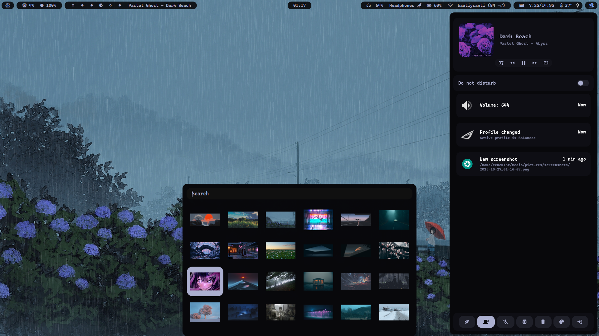
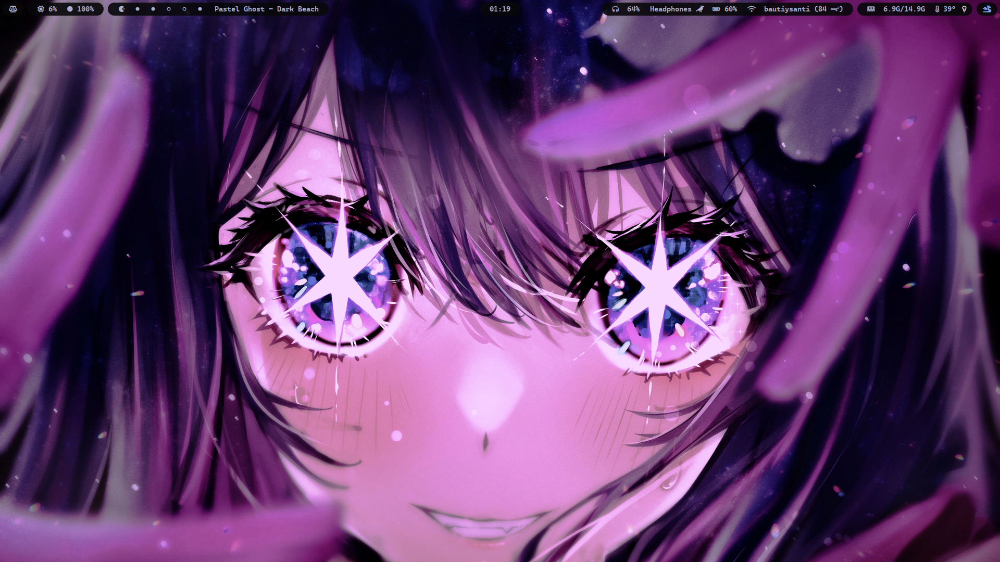
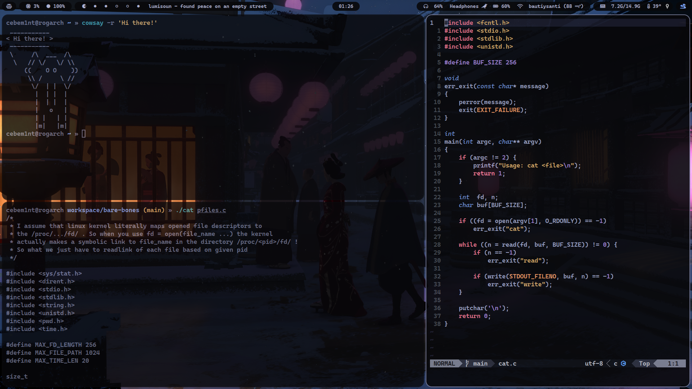
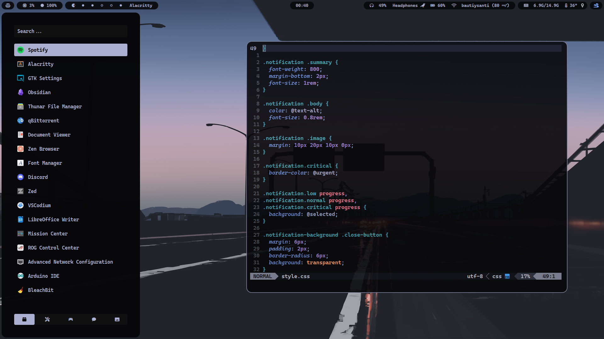

# My dotfiles

## Info

- Panel: waybar
- All the menus (except notifications): rofi
- Notifications: swaync
- Terminal: alacritty
- Shell: zsh
- Font: Cascadia Code
- GTK theme: [kripton](https://github.com/EliverLara/Kripton)
- Icon theme: [Papirus](https://github.com/PapirusDevelopmentTeam/papirus-icon-theme)
- fetch: [mine :)](https://github.com/cebem1nt/sillyfetch)

Big thanks to this [collection of rofi themes](https://github.com/adi1090x/rofi)

## Previews










## Structure
```
hypr # Hyprland configuration
├── configs
│   ├── animations.conf 
│   ├── binds.conf
│   ├── environ.conf
│   ├── exec.conf <- Startup scripts
│   ├── rules.conf <- Window/layer rules
│   └── settings.conf <- Misc settings
├── hypridle.conf
├── hyprland.conf <- Monitor configuration is here
├── hyprlock.conf
└── scripts
    ├── resize_gaps
    └── switch_layout
```

## Binds

#### Apps:
- `SUPER + ;` -> Open terminal
- `SUPER + n` -> Open browser
- `SUPER + m` -> Open vscodium
- `SUPER + b` -> Open thunar

#### Navigation:
- `SUPER + arrow keys` -> move focus in direction
- `SUPER + 1...6` -> go to workspace
- `SUPER SHIFT + 1...6` -> move to workspace
- `SUPER CTRL + 1...6` -> move & go to workspace
- `SUPER + s` -> toggle special workspace
- `SUPER SHIFT + s` -> move to special workspace

#### Actions
- `SUPER + q` -> close window
- `SUPER SHIFT + q` -> kill window 
- `SUPER + w` -> center window 
- `SUPER + f` -> toggle floating window 
- `SUPER SHIFT + f` -> fullscreen window 

#### Menus:
- `SUPER + r` -> Drun (app runner)
- `SUPER + t` -> Notification center
- `SUPER + v` -> Clipboard
- `SUPER + y` -> Wallpapers
- `SUPER + ESCAPE` -> Logout
- `SUPER + e` -> Filebrowser
- `SUPER SHIFT + v` -> Glyphs selector
- `SUPER SHIFT + r` -> Shell commands runner
- `SUPER SHIFT + e` -> Bookmarks

For more detailed info see `.config/hypr/configs/binds.conf`

## Installation

This installation assumes you have a minimal working system! Firstly install all the necessary packages acording to your distribution. On arch you can copy these:

> [!NOTE]  
> Installation script already installs papirus icon theme and Kripton GTK theme. But does not install the cascadia code font. You should install it manually in case if you are not on archlinux.

```sh
sudo pacman -S hyprland hyprlock hypridle waybar swaync alacritty cava rofi peaclock pavucontrol thunar zsh ttf-cascadia-code ttf-cascadia-code-nerd swww python-psutil
```

For spotify theme install [spicetify](), browser is [zen]() by default, you can change it in `.config/hypr/configs/binds.conf`.

Now clone & run the installer:

> [!WARNING]  
> My dotfiles are __laptop specific__. Despite trying to make a flexible installation script, some of the things might not work! You better install everything manually based on your needs, or use this repository as an inspiration.

```sh
git clone https://github.com/cebem1nt/dotfiles.git
cd dotfiles
./install # Dont run as super user!
```

## Uninstallation
Just run `restore` script, it will restore all your previous config files stored at `~/.local/old`.

```sh
./restore
```

## Something doesnt work? 
Feel free to post an issue or contribute!
