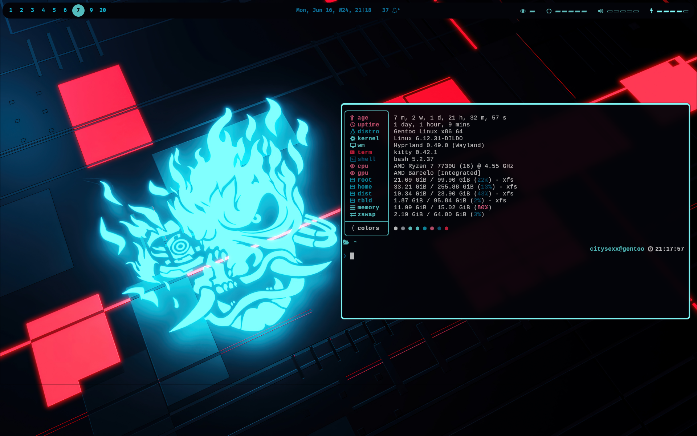

# gentoo-dots
Dotfiles and install advices for Gentoo Linux x Hyprland setup

## Sexy looks

## Something Beautiful
This has already been configured to use pywal (you can swich themes and colors will adjust in terminal, neovim and waybar)

## Something Stupid
I have been ricing this and forgot to create a backup, had to start over again

## Something Unforgivable
My Gentoo world compiles for 28 hours (without chromium). So i do rarely update the system. And do backups of my configs and emerge logs before i do. But gentoo is stable for real.

## Note
Newer rices include different set of packages needed. For example, as of June, I no longer use mako and dunst as notification daemons. I use swaync.

## hypr/scripts
This is a good scripts dir that i created to handle some tasks, i kindly share then with you.

## Prerequisites:
- Amd64-architecture computer
- It is assumed you have installed Gentoo Linux using AMD64 Handbook and set up a minimal recommended configuartion described in this Handbook
- Guru Repository Enabled
- Packages:
    - `hyprland`
    - `hyprpaper`
    - `hyprshot`
    - [Not Obligatory, but Recommended] other hyprland ecosystem packages
    - `gojq`
    - `wofi`
    - `tofi`
    - `rofi`
    - `ranger`
    - `swaync`
    - `neovim`
    - `noto-emoji`
    - `kitty`
    - `waybar`
    - `feh`
    - `pywal`
    - Nerd Font (You can use any)

## Future considerations
*Note* that this repo does not aim to provide the full OOTB desktop experience. These dotfiles, as well as script, are for the community members who want a clean ricing base to lean on. Use this repo to build your own setup and do not forget to share it!
*Also Note:* some paths in my dots are absolute (which means you have to adjust them to ~/ instead of /home/user/)

Regards, 
citysexx
