# Dotfiles for my theme of hyprland (inspired by tailwind)

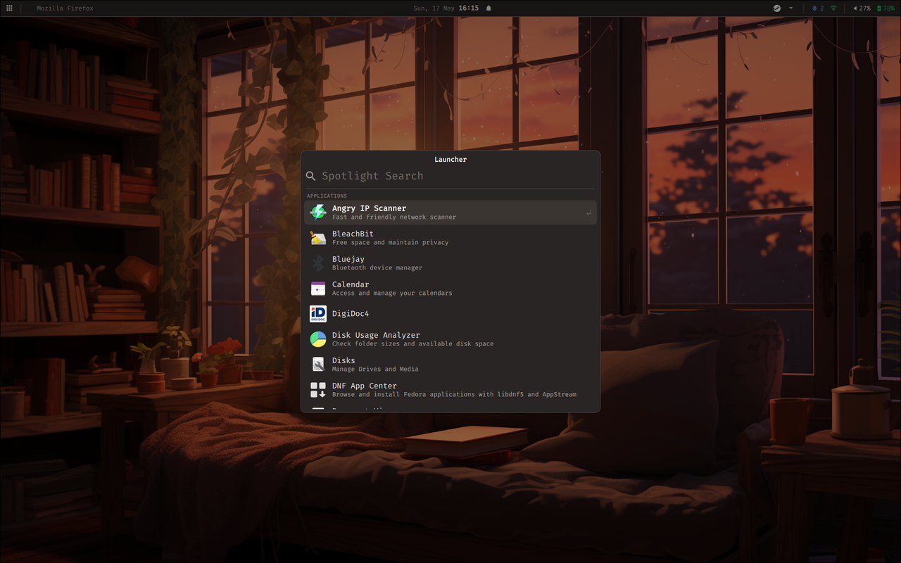

## Gallery

The top bar (always visible):

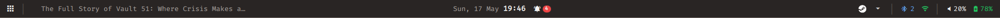

Modals reachable from keybindings or the bar:

<table>
  <tr>
    <td align="center" width="33%">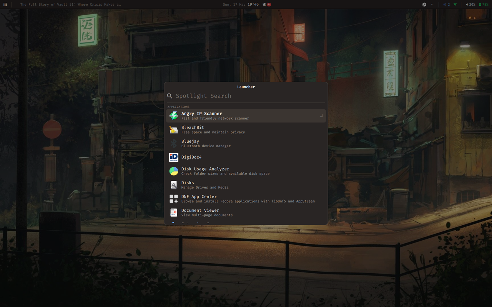<br><strong>Spotlight</strong><br><kbd>Super</kbd>+<kbd>R</kbd></td>
    <td align="center" width="33%">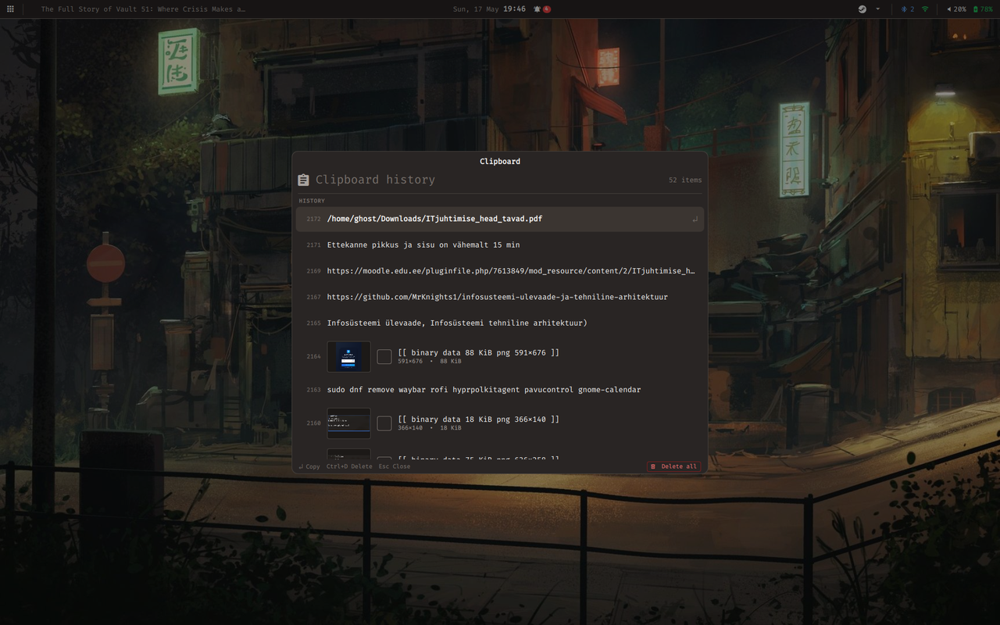<br><strong>Clipboard</strong><br><kbd>Super</kbd>+<kbd>V</kbd></td>
    <td align="center" width="33%">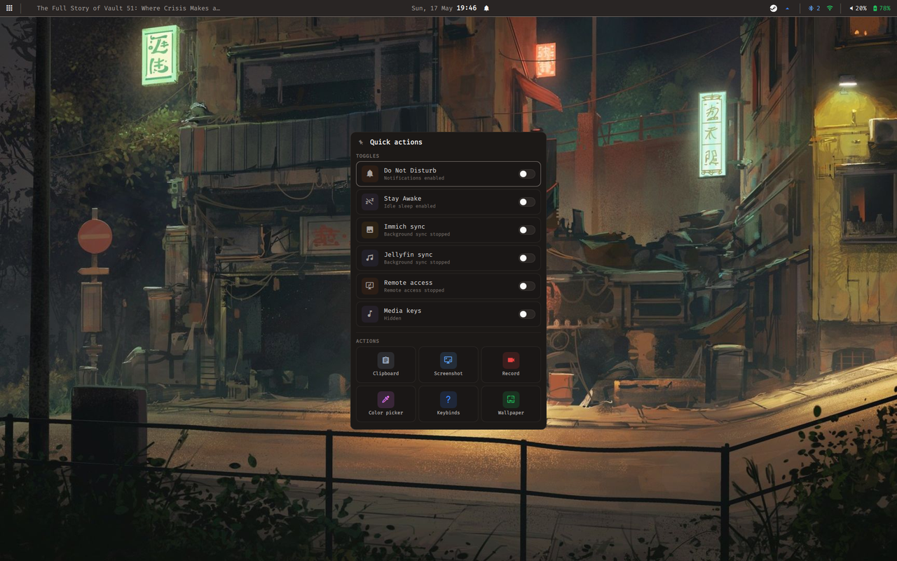<br><strong>Quick Actions</strong><br><kbd>Super</kbd>+<kbd>A</kbd></td>
  </tr>
  <tr>
    <td align="center">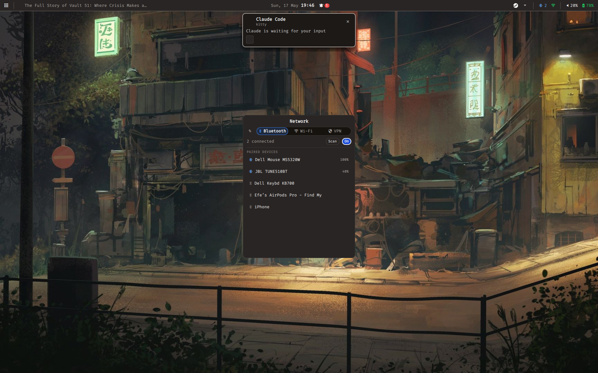<br><strong>Network</strong><br><kbd>Super</kbd>+<kbd>Shift</kbd>+<kbd>B</kbd></td>
    <td align="center">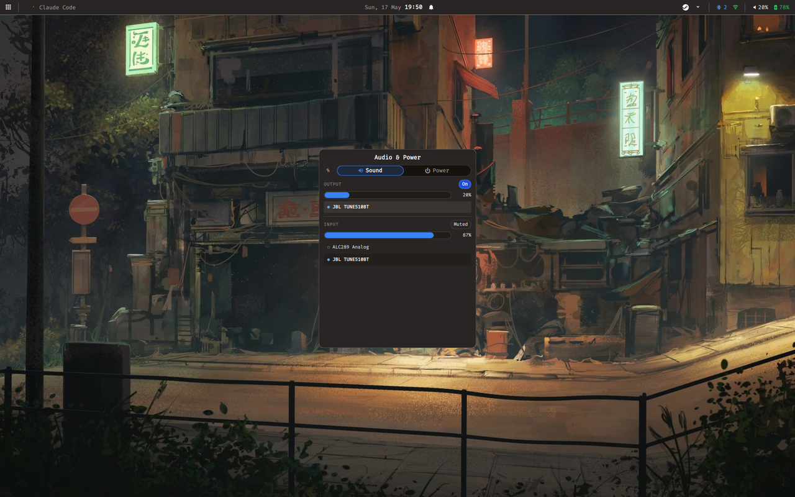<br><strong>Audio &amp; Power</strong><br><kbd>Super</kbd>+<kbd>S</kbd></td>
    <td align="center">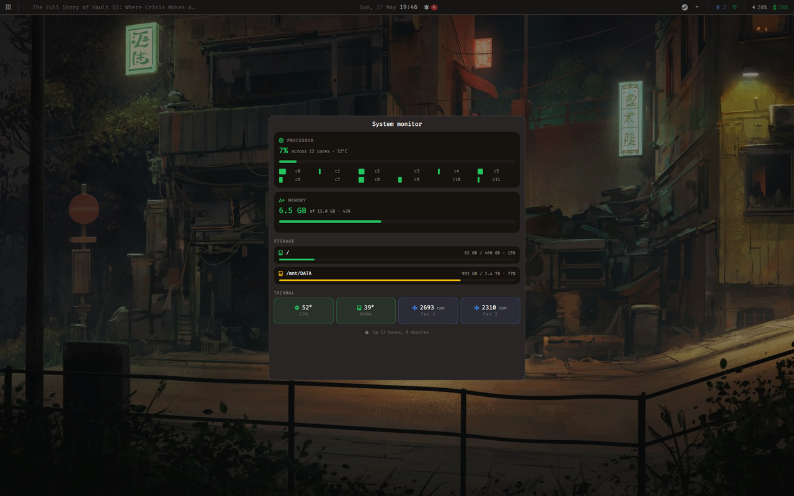<br><strong>System Monitor</strong><br><kbd>Super</kbd>+<kbd>M</kbd></td>
  </tr>
  <tr>
    <td align="center">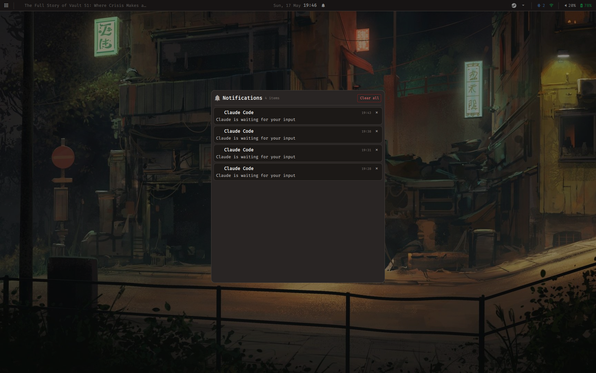<br><strong>Notification Center</strong><br><kbd>Super</kbd>+<kbd>N</kbd></td>
    <td align="center">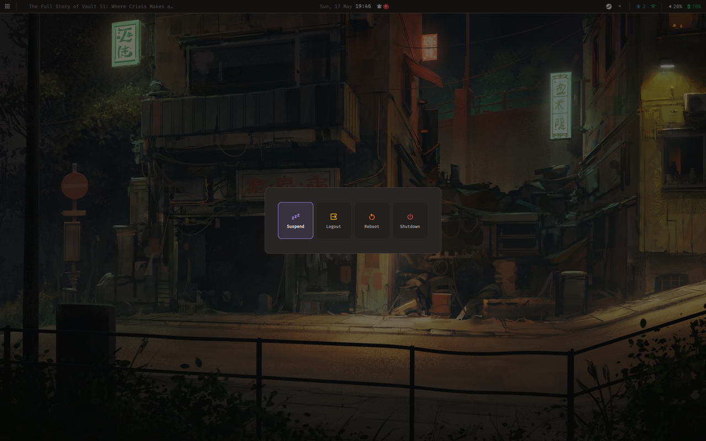<br><strong>Power Menu</strong><br><kbd>Super</kbd>+<kbd>Shift</kbd>+<kbd>E</kbd></td>
    <td align="center">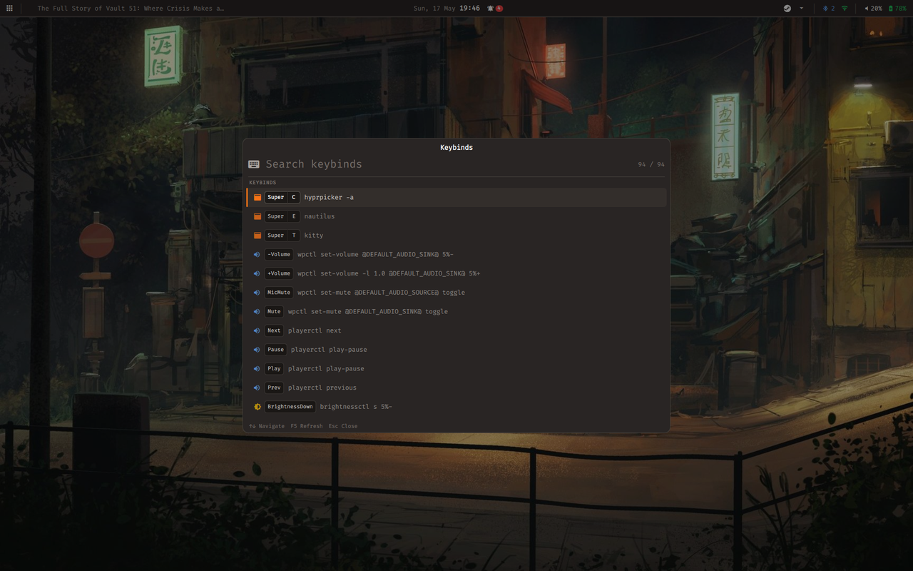<br><strong>Keybinds Viewer</strong><br><kbd>Super</kbd>+<kbd>F1</kbd></td>
  </tr>
  <tr>
    <td align="center">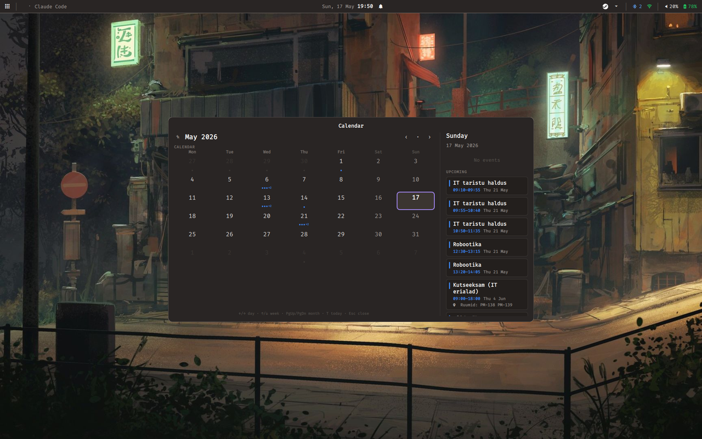<br><strong>Calendar</strong><br><kbd>Super</kbd>+<kbd>D</kbd></td>
    <td align="center">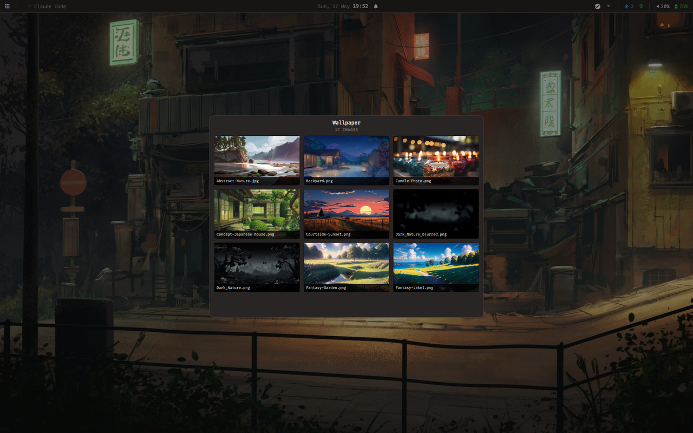<br><strong>Wallpaper Picker</strong><br><kbd>Super</kbd>+<kbd>W</kbd></td>
    <td align="center">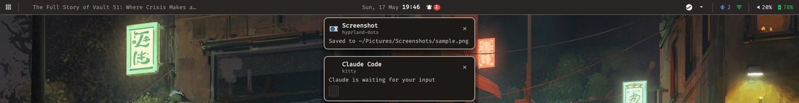<br><strong>Notification Toast</strong><br>auto-shown on incoming notification</td>
  </tr>
</table>

> [!TIP]
> Use `setup.sh` for automated installation, or `dotfiles-manager.sh` for managing symlinks.

> [!NOTE]
> Built on Nobara 43. Some commands are Fedora/Nobara specific.

## Documentation

- [`ARCHITECTURE.md`](ARCHITECTURE.md) — how Hyprland, Quickshell, scripts, and cron fit together
- [`KEYBINDS.md`](KEYBINDS.md) — flat keybind reference (live viewer: `Super+F1`)
- [`quickshell/DESIGN.md`](quickshell/DESIGN.md) — QML widget conventions and recipes
- [`scripts/README.md`](scripts/README.md) — per-script breakdown (what runs when)
- [`hypr/MODULES.md`](hypr/MODULES.md) — what each `hypr/modules/*.conf` owns

## Dependencies

- `hyprland` + `hyprland-devel` — compositor
- `quickshell` — bar, OSD, notifications, launcher, clipboard, power menu, keybinds viewer, workspace overview
- `kitty` — terminal
- `nautilus` — file manager
- `cliphist` + `wl-clipboard` — clipboard history (Quickshell shows the picker)
- `hyprpaper` `hyprpicker` `hypridle` `hyprlock` — wallpaper, color picker, idle daemon, lock screen
- `grim` `slurp` `swappy` — screenshots
- `tesseract` — OCR from screenshots
- `gpu-screen-recorder` — screen recording
- `firefox` — browser
- `brightnessctl` `playerctl` — brightness and media control (Quickshell OSD watches `/sys` for changes)
- `gnome-keyring` — secrets store
- `powerprofilesctl` — power profiles
- `python3` + `python3-pillow` — avatar generation
- `jq` — JSON parsing
- `inotify-tools` — dotfile hot-reload daemon

## Install Dependencies (Nobara 43)

### External repositories

```bash
sudo dnf copr enable lionheartp/Hyprland       # hyprland
sudo dnf copr enable errornointernet/quickshell  # quickshell (or build from source)
```

### Install all dependencies

```bash
sudo dnf install hyprland hyprland-devel quickshell kitty nautilus cliphist \
  hyprpaper hyprpicker hypridle hyprlock grim slurp swappy tesseract \
  wl-clipboard firefox brightnessctl playerctl \
  gnome-keyring jq \
  powerprofilesctl gpu-screen-recorder inotify-tools \
  fish ranger python3 python3-pillow
```

## Setup

### One-command Install (Recommended)

```bash
bash <(curl -fsSL https://raw.githubusercontent.com/Gren-95/hyprland-dots/main/install.sh)
```

This will clone the repo to `~/dotfiles` and run the setup script automatically.

### Manual Setup

```bash
git clone https://github.com/Gren-95/hyprland-dots.git ~/dotfiles
cd ~/dotfiles
chmod +x setup.sh
./setup.sh
```

The setup script will:
- Check for missing dependencies and offer to install them
- Create symlinks for all config directories
- Create required user directories (`~/Pictures/Screenshots`, `~/Music`, etc.)
- Set up script permissions
- Configure GTK theme
- Optionally generate an initials avatar for the lock screen

### Wallpapers

Put your wallpapers in `~/Pictures/wallpapers/`. They are preloaded automatically on startup — no manual config needed. The lock screen background also updates to the current wallpaper automatically.

### Idle timeout

```bash
$EDITOR hypr/hypridle.conf
```

### Keybinds

```bash
$EDITOR hypr/modules/keys.conf
```

Press `Super+F1` in session to view all active keybinds.

### OSD

Volume, brightness, and keyboard-backlight OSDs are rendered by Quickshell
(`quickshell/Osd.qml`). It polls `/sys/class/backlight` and `/sys/class/leds`
so any process changing brightness — key, `brightnessctl`, `hypridle` —
triggers the OSD automatically. No daemon to enable.

### Screen Recording

`Super+Shift+R` — toggles screen recording. Recordings are saved to `~/Videos/Recordings/`.

Requires `gpu-screen-recorder`. A brief toast appears top-right on start/stop
(it auto-hides during recording so it doesn't appear in the captured video).

### Remote Access (wayvnc)

wayvnc is an optional VNC server for remote desktop access.

**Start/stop:** `Super+Ctrl+R` — toggles wayvnc on/off.

**Connect:** Use any VNC viewer and connect to `<local-ip>:5900`.

**Security:** Default config binds to `0.0.0.0` with no auth — suitable for trusted LAN only. For remote access, use [Tailscale](https://tailscale.com).

To add password auth, edit `wayvnc/config`:

```ini
enable_auth=true
username=user
password=yourpassword
```

## Background Daemons

These run automatically on login via `restart.sh` and restart cleanly on each session.

| Script | Purpose |
|---|---|
| `battery-notify.sh` | Notifies at 20% and 10% battery; dismisses alert when plugged in |
| `dotwatch.sh` | Watches dotfiles for changes and hot-reloads affected services |
| `media-inhibit.sh` | Prevents screen sleep during media playback |
| `network-notify.sh` | Notifies on network connect/disconnect |

### dotwatch — hot-reload

Edits to dotfiles are picked up automatically without restarting your session:

| File changed | Action |
|---|---|
| `hypr/hyprland.conf`, `hypr/modules/*` | `hyprctl reload` |
| `hypr/hypridle.conf` | Restart hypridle |
| `hypr/hyprlock.conf` | Notification (applies on next lock) |
| `gtk-3.0/gtk.css` | Notification (restart GTK apps to apply) |
| `quickshell/*` | Quickshell auto-reloads on file changes |

## Optional Services

### Immich (photo sync)

Automatically uploads `~/Pictures/` to your Immich server every hour. Notifies when new photos are uploaded.

**Setup:**

```bash
npm install -g @immich/cli --prefix ~/.npm-global
immich login https://your-immich-server/api YOUR_API_KEY
```

Auth is stored in `~/.config/immich/auth.yml` (gitignored).

### Jellyfin (music sync)

Syncs your Jellyfin music library to `~/Music/` every 2 hours. Jellyfin is the master — tracks removed from Jellyfin are deleted locally. Notifies after each sync with a download/skip/remove summary.

**Setup:**

```bash
bash ~/.config/scripts/jellyfin-music-sync.sh
```

You will be prompted for your Jellyfin server URL and API key on first run. Config is stored in `~/.config/jellyfin/sync.conf` (gitignored). To reconfigure, delete the file and run the script again.

## Dotfiles Manager

```bash
./dotfiles-manager.sh status          # Check all symlink states
./dotfiles-manager.sh backup          # Create symlinks (backs up existing dirs)
./dotfiles-manager.sh backup --dry-run  # Preview without making changes
./dotfiles-manager.sh fix             # Fix broken or inconsistent symlinks
./dotfiles-manager.sh undo            # Restore backups and remove symlinks
```
